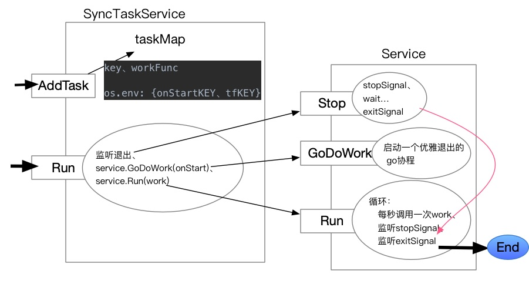

# 1. go-timing-task简介
go-timing-task是一个由Go开发的定时任务小框架。

**主要功能包括：**
1. 支持添加多个定时任务，按 `秒 分 时 日 月 年` 的时间格式匹配执行，例如：`0 0-59/30 * * * *` 表示每小时的0分、30分执行。
2. 支持添加多个启动时执行的任务。
3. 通过环境变量配置执行。

**主要特性：**
1. 各个任务独立运行，互不影响。
2. 支持优雅退出。程序退出时，会等待所有正在执行的任务完成当次执行。

# 2. go-timing-task图解



# 3. 使用方法
```cmd
go get github.com/dekunt/go-timing-task/task

import "github.com/dekunt/go-timing-task/task"
```

例子：
```go
package main
import	(
    "github.com/dekunt/go-timing-task/task"
    "fmt"
    "os"
    "time"
)

func main() {
    server := task.SyncTaskService{}
	
    //定义任务
    key := "Task1"
    task1Func := func() {
        fmt.Println("task1...")
        time.Sleep(3 * time.Second) //用于验证优雅退出，任务正在执行时，会等该任务执行完再退出整个程序
        fmt.Println("task1 done.")
    }
    //环境变量配置
    os.Setenv("tf"+key, "0-59/2 * * * * *") //通过环境变量tf{KEY}配置：每2秒执行一次
    //os.Setenv("onStart"+key, "1")           //通过环境变量onStart{KEY}配置：启动时执行

    //添加任务
    server.AddTask(key, task1Func)

    go func() {
        //5秒后退出
        for i := 0; i < 10; i++ {
            fmt.Println("main-work ...")
            time.Sleep(500 * time.Millisecond)
        }
        server.Stop()
    }()
    //启动服务
    server.Run()
}
```
